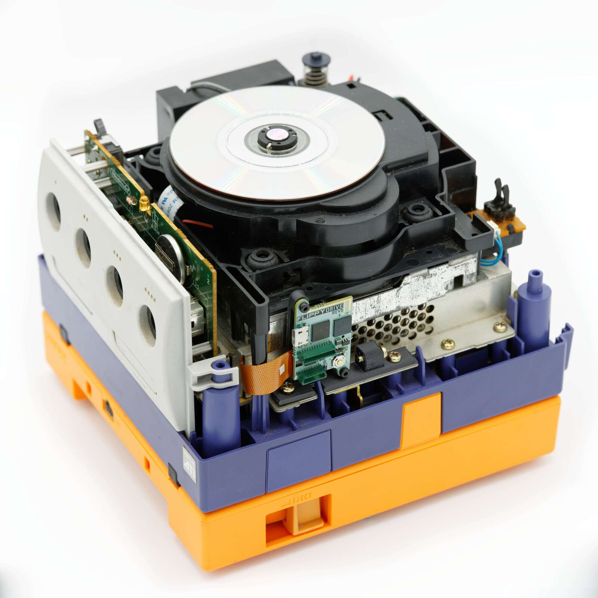
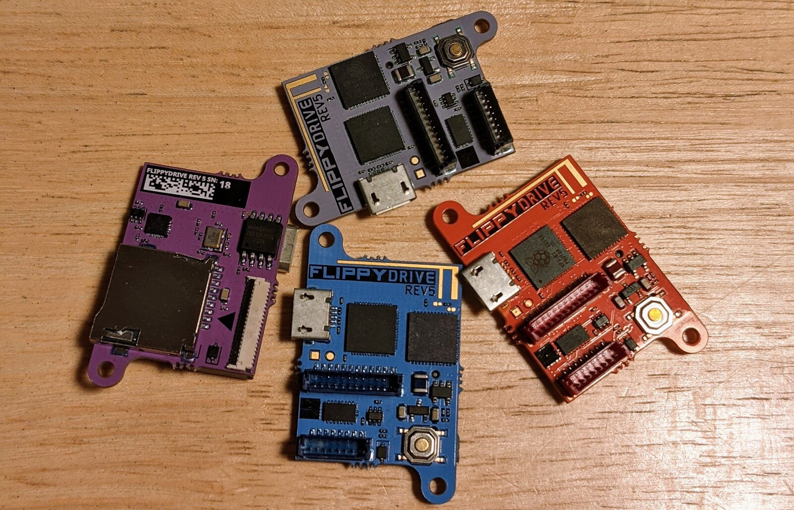

# FlippyDrive
A disc drive emulator for the gamecube that lets you keep your existing drive!

## Upcoming FlippyDrive Release
The exciting new FlippyDrive modchip will be available beginning of 2024. Expect to see Reviewer content in the next few weeks!

**Pre-order Email Sign-ups are live on** [flippydrive.com](https://flippydrive.com/)

#### It will have have the following specs and features:
- No-solder internal install into the original Disc Drive slot
- Load games from SD Card
- Experimental loading over Wi-Fi (RPi / PC / NAS)
- No software patching required (Games can run Stock)
- Compatible with [Cubeboot](https://github.com/OffBroadway/cubeboot) menu patcher
- Also support for loading games and homebrew with Swiss
- Uses commodity RP2040+ESP32 parts making a shortage unlikely
- Original Nintendo disc drivers are not destroyed to get connectors
- Keep your original disc drive installed and play physical discs

#### Upcoming Features
- Backup your own games at speed using the disc drive (~10 min/disk)
- Bluetooth Controller support
- USB Game Controller support
- Configuration webapp in Chrome using BLE

#### Upcoming add-ons
- Ethernet Adapter
- USB Drive Loader (Including SSD/HDD adapters)
  

