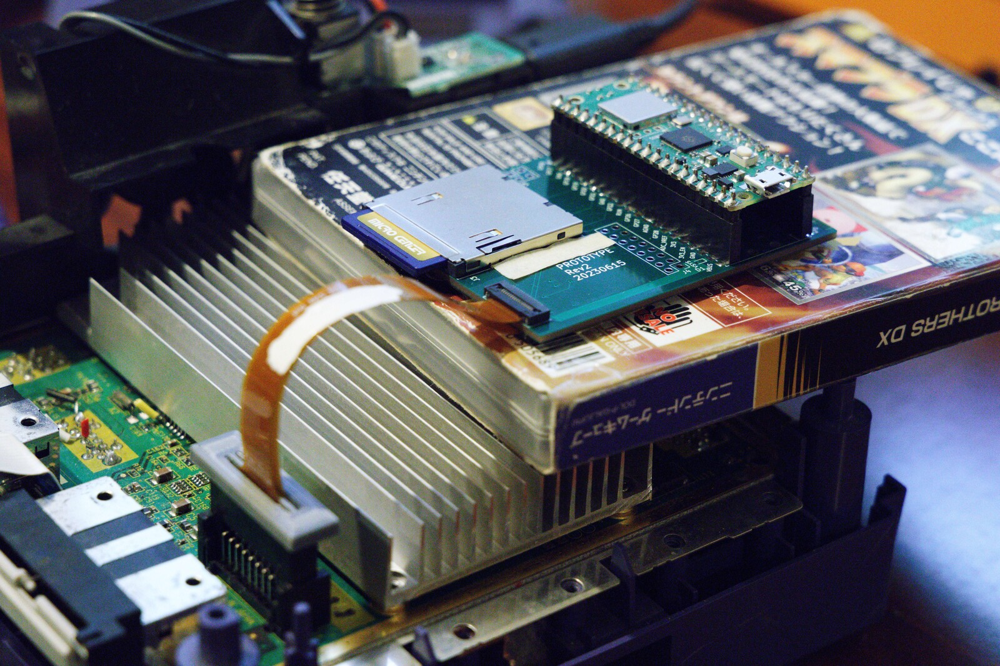

# FlippyDrive
An open-source ODE modchip for GameCube!

## Upcoming FlippyDrive Release
The exciting new FlippyDrive modchip will be available for Pre-order September 9th at the tentative price of $25 without Pico or $32 with Pico W included ($35 with $3 preorder discount).

#### It will have have the following specs and features:
- No-solder internal install into the original Disc Drive slot
- Load Games on SD Card
- Load Games over WiFi (RPi / PC / NAS)
- Configuration with BLE using PC or Phone
- No Software Patching (Games run Stock)
- Built-in Game Selection without using Swiss (Based on cubeboot)
- Also Support for loading Games with Swiss
- Uses commodity RP2040 parts making a parts-shortage unlikely
- Original Nintendo Disc Drivers are not destroyed to get connectors

#### Upcoming Features (2024)
- Bluetooth Game Controller support for Pico W

#### Upcoming add-ons
- USB Drive Loader (Including SSD/HDD adapters)
- USB Game Controller support

--- 

There are some features which we have not confirmed 100% and will be doing research and development on in the next few months.

#### Unconfirmed Features
- Keep the original Disc Drive installed and play physical Discs
